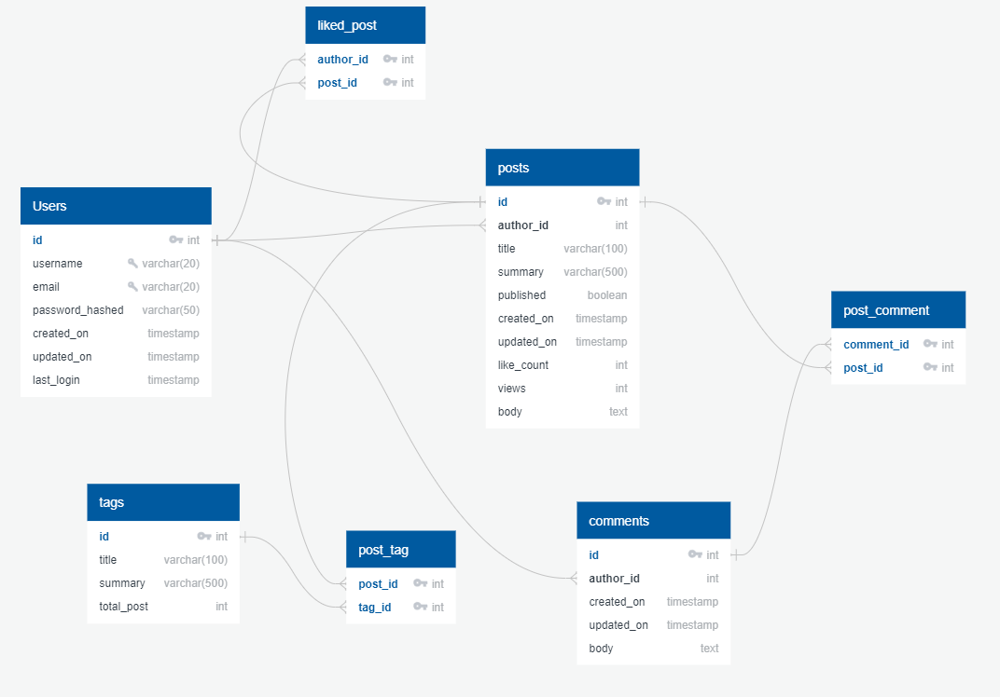

# Tables & Relatioship



# How To create tables

1.  **Create a database**

    ```sql
    CREATE DATABASE blog;
    ```

    OR

    _In command-line_

    ```bash
    createdb -h localhost -p 5432 -U postgres blog
    ```

2.  **Select database**

    ```sql
    \c blog;
    ```

    OR

    _In command-line_

    ```bash
    psql -h localhost -p 5432 -U postgress blog
    ```

3.  **Create Table**

    <details>
    <summary><strong>User table</strong> </summary>

    ```sql
     CREATE TABLE IF NOT EXISTS USERS(
     ID              SERIAL   PRIMARY KEY,
     USERNAME        VARCHAR(20) NOT NULL UNIQUE,
     EMAIL           VARCHAR(20) NOT NULL UNIQUE,
     PASSWORD_HASHED VARCHAR(50) NOT NULL,
     CREATED_ON      timestamp DEFAULT CURRENT_TIMESTAMP,
     UPDATED_ON      timestamp DEFAULT CURRENT_TIMESTAMP,
     LAST_LOGIN      timestamp DEFAULT CURRENT_TIMESTAMP
     );
    ```

    Print table `\d users`

    | Column          | Type                        | Nullable | Default                           |
    | --------------- | --------------------------- | -------- | --------------------------------- |
    | id              | integer                     | not null | nextval('users_id_seq'::regclass) |
    | username        | character varying(20)       | not null |
    | email           | character varying(20)       | not null |
    | password_hashed | character varying(50)       | not null |
    | created_on      | timestamp without time zone |          | CURRENT_TIMESTAMP                 |
    | updated_on      | timestamp without time zone |          | CURRENT_TIMESTAMP                 |
    | last_login      | timestamp without time zone |          | CURRENT_TIMESTAMP                 |

    Indexes:

    - "users_pkey" PRIMARY KEY, btree (id)
    - "users_email_key" UNIQUE CONSTRAINT, btree (email)
    - "users_username_key" UNIQUE CONSTRAINT, btree (username)

    </details>

    <details>
    <summary><strong>Post Table</strong> </summary>

    ```sql
     CREATE TABLE IF NOT EXISTS POSTS(
     ID              SERIAL   PRIMARY KEY,
     AUTHOR_ID       INTEGER NOT NULL,
     TITLE           VARCHAR(100) NOT NULL,
     SUMMARY         VARCHAR(500),
     PUBLISHED       BOOLEAN DEFAULT FALSE,
     CREATED_ON      timestamp DEFAULT CURRENT_TIMESTAMP,
     UPDATED_ON      timestamp DEFAULT CURRENT_TIMESTAMP,
     LIKE_COUNT      INTEGER DEFAULT 0,
     VIEWS           INTEGER DEFAULT 0,
     BODY            TEXT,
     FOREIGN KEY (AUTHOR_ID)
         REFERENCES USERS (ID)
         ON DELETE NO ACTION
         ON UPDATE NO ACTION

     );
    ```

    Print table `\d posts`

    | Column     | Type                        | Nullable | Default                          |
    | ---------- | --------------------------- | -------- | -------------------------------- |
    | id         | integer                     | not null | nextval('post_id_seq'::regclass) |
    | author_id  | integer                     | not null |
    | title      | character varying(100)      | not null |
    | summary    | character varying(500)      |          |
    | published  | boolean                     |          | false                            |
    | created_on | timestamp without time zone |          | CURRENT_TIMESTAMP                |
    | updated_on | timestamp without time zone |          | CURRENT_TIMESTAMP                |
    | like_count | integer                     |          | 0                                |
    | views      | integer                     |          | 0                                |
    | body       | text                        |          |

    Indexes:

    - "posts_pkey" PRIMARY KEY, btree (id)
    - Foreign-key constraints:
      "posts_author_id_fkey" FOREIGN KEY (author_id) REFERENCES users(id)

    </details>
    <details>
    <summary><strong>Comments Table</strong> </summary>

    ```sql
    CREATE TABLE IF NOT EXISTS COMMENTS(
    ID              SERIAL   PRIMARY KEY,
    AUTHOR_ID       INTEGER NOT NULL,
    CREATED_ON      timestamp DEFAULT CURRENT_TIMESTAMP,
    UPDATED_ON      timestamp DEFAULT CURRENT_TIMESTAMP,
    BODY            TEXT,
    FOREIGN KEY (AUTHOR_ID)
        REFERENCES USERS (ID)
        ON DELETE NO ACTION
    );
    ```

    Print table `\d COMMENTS`

    | Column     | Type                        | Nullable | Default                          |
    | ---------- | --------------------------- | -------- | -------------------------------- |
    | id         | integer                     | not null | nextval('post_id_seq'::regclass) |
    | author_id  | integer                     | not null |
    | created_on | timestamp without time zone |          | CURRENT_TIMESTAMP                |
    | updated_on | timestamp without time zone |          | CURRENT_TIMESTAMP                |
    | body       | text                        |          |

    Indexes:

    - "comments_pkey" PRIMARY KEY, btree (id)
    - Foreign-key constraints:
      "comments_author_id_fkey" FOREIGN KEY (author_id) REFERENCES users(id)

    </details>

    <details>
    <summary><strong>Tags Table</strong> </summary>

    ```sql
    CREATE TABLE IF NOT EXISTS TAGS(
    ID              SERIAL   PRIMARY KEY,
    TITLE           VARCHAR(100) NOT NULL,
    SUMMARY         VARCHAR(500),
    TOTAL_POST      INTEGER DEFAULT 0
    );
    ```

    Print table `\d COMMENTS`

    | Column     | Type                   | Nullable | Default                          |
    | ---------- | ---------------------- | -------- | -------------------------------- |
    | id         | integer                | not null | nextval('tags_id_seq'::regclass) |
    | title      | character varying(100) | not null |
    | summary    | character varying(500) |          |
    | total_post | integer                |          | 0                                |

    Indexes:

    - "tags_pkey" PRIMARY KEY, btree (id)

    </details>
    <details>
    <summary><strong>Post Tags Table</strong> </summary>

    ```sql
    CREATE TABLE IF NOT EXISTS POST_TAGS(
    POST_ID     INTEGER NOT NULL,
    TAG_ID      INTEGER NOT NULL,
    PRIMARY KEY (POST_ID,TAG_ID),
    FOREIGN KEY (POST_ID)
        REFERENCES POSTS (ID)
        ON DELETE CASCADE,
    FOREIGN KEY (TAG_ID)
        REFERENCES TAGS (ID)
        ON DELETE CASCADE
    );
    ```

    Print table `\d POST_TAGS`

    | Column  | Type    | Nullable |
    | ------- | ------- | -------- |
    | post_id | integer | not null |
    | tag_id  | integer | not null |

    Indexes:

    - "post_tags_pkey" PRIMARY KEY, btree (post_id, tag_id)

    Foreign-key constraints:

    - "post_tags_post_id_fkey" FOREIGN KEY (post_id) REFERENCES post(id) ON DELETE CASCADE
    - "post_tags_tag_id_fkey" FOREIGN KEY (tag_id) REFERENCES tags(id) ON DELETE CASCADE

    </details>
    <details>
    <summary><strong>Post Comments Table</strong> </summary>

    ```sql
    CREATE TABLE IF NOT EXISTS POST_COMMENTS(
    COMMENT_ID      INTEGER NOT NULL,
    POST_ID         INTEGER NOT NULL,
    PRIMARY KEY (COMMENT_ID,POST_ID),
    FOREIGN KEY (COMMENT_ID)
        REFERENCES COMMENTS (ID)
        ON DELETE CASCADE,
    FOREIGN KEY (POST_ID)
        REFERENCES POSTS (ID)
        ON DELETE CASCADE
    );
    ```

    Print table `\d POST_COMMENTS`

    | Column     | Type    | Nullable |
    | ---------- | ------- | -------- |
    | comment_id | integer | not null |
    | post_id    | integer | not null |

    Indexes:

    - "post_comments_pkey" PRIMARY KEY, btree (comment_id, post_id)

    Foreign-key constraints:

    - "post_comments_comment_id_fkey" FOREIGN KEY (comment_id) REFERENCES comments(id) ON DELETE CASCADE
    - "post_comments_post_id_fkey" FOREIGN KEY (post_id) REFERENCES post(id) ON DELETE CASCADE

    </details>
    <details>
    <summary><strong>Post likes Table</strong> </summary>

    ```sql
    CREATE TABLE IF NOT EXISTS POST_LIKES(
    AUTHOR_ID       INTEGER NOT NULL,
    POST_ID         INTEGER NOT NULL,
    PRIMARY KEY (AUTHOR_ID,POST_ID),
    FOREIGN KEY (AUTHOR_ID)
        REFERENCES USERS (ID)
        ON DELETE NO ACTION,
    FOREIGN KEY (POST_ID)
        REFERENCES POSTS (ID)
        ON DELETE CASCADE
    );
    ```

    Print table `\d POST_LIKES`

    | Column    | Type    | Nullable |
    | --------- | ------- | -------- |
    | author_id | integer | not null |
    | post_id   | integer | not null |

    Indexes:

    - "post_likes_pkey" PRIMARY KEY, btree (author_id, post_id)

    Foreign-key constraints:

    - "post_likes_author_id_fkey" FOREIGN KEY (author_id) REFERENCES users(id)
    - "post_likes_post_id_fkey" FOREIGN KEY (post_id) REFERENCES post(id) ON DELETE CASCADE

    </details>

4.  **Create Triggers**

    <details>
    <summary><strong>For Updating LIKE Counter in Post</strong> </summary>

    ```sql

    CREATE FUNCTION updateLike() RETURNS TRIGGER
        AS $BODY$
            BEGIN
                IF (TG_OP = 'INSERT') THEN
                    UPDATE POSTS
                        set LIKE_COUNT = LIKE_COUNT + 1
                        where id = new.POST_ID;
                    RETURN NEW;
                ELSIF (TG_OP='DELETE') THEN
                    UPDATE POSTS
                        set LIKE_COUNT = LIKE_COUNT - 1
                        where id = old.POST_ID;
                    RETURN OLD;
                END IF;
                RETURN NULL;
            END;
        $BODY$
    LANGUAGE plpgsql;

    CREATE TRIGGER UPDATE_LIKE_COUNT
        AFTER INSERT OR DELETE ON POST_LIKES
        FOR EACH ROW EXECUTE PROCEDURE updateLike();
    ```

    </details>

    <details>
    <summary><strong>For Updating Post Count in tags</strong> </summary>

    ```sql
    CREATE FUNCTION updatePostCount() RETURNS TRIGGER
        AS $BODY$
            BEGIN
                IF (TG_OP = 'INSERT') THEN
                    UPDATE TAGS
                        set TOTAL_POST = TOTAL_POST + 1
                        where id = new.TAG_ID;
                    RETURN NEW;
                ELSIF (TG_OP='DELETE') THEN
                    UPDATE TAGS
                        set TOTAL_POST = TOTAL_POST - 1
                        where id = old.TAG_ID;
                    RETURN OLD;
                END IF;
                RETURN NULL;
            END;
        $BODY$
    LANGUAGE plpgsql;

    CREATE TRIGGER UPDATE_TAG_POST_COUNT
        AFTER INSERT OR DELETE ON POST_TAGS
        FOR EACH ROW EXECUTE PROCEDURE updatePostCount();

    ```

    </details>
